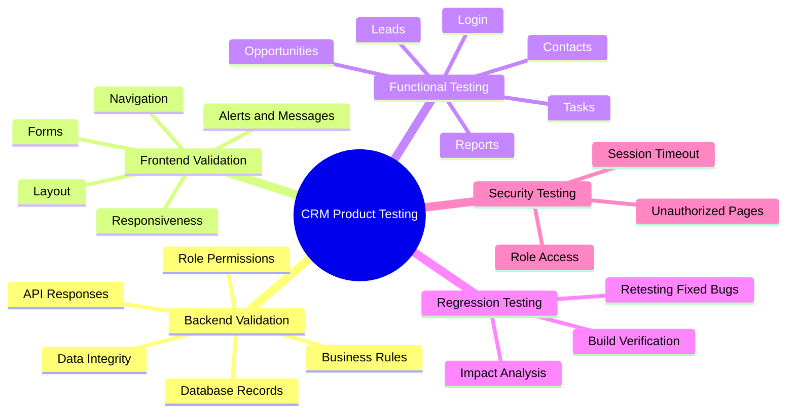
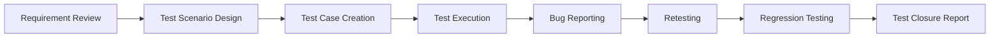

<div align="center">


<br />


### CRM Product Testing, backend validation, frontend validation, and functional testing.

</div>

---

## 🌟 Project Overview

This repository showcases a structured **CRM Product Testing** project designed to validate customer relationship management workflows from both **business** and **end-user** perspectives.

The project covers key CRM modules such as **Login, Leads, Contacts, Accounts, Opportunities, Tasks, Reports, Dashboards, Notifications, and Role-Based Access Control**.

---

## 🎯 Project Goals

| Goal | Description |
|---|---|
| ✅ Validate CRM workflows | Ensure CRM features work correctly across sales, support, marketing, and admin flows. |
| 🔗 Verify backend behavior | Check APIs, database updates, server-side validation, permissions, and business rules. |
| 🎨 Improve frontend experience | Validate UI consistency, responsiveness, forms, messages, buttons, navigation, and usability. |
| 🧪 Confirm functional accuracy | Test end-to-end user actions and confirm expected system behavior. |
| 🐞 Identify defects | Report functional, validation, UI, usability, security, and data-related issues clearly. |
| 🚀 Support release quality | Improve product stability before production release. |

---

## 🔍 Validation Scope

<div align="center">

| 🔗 Backend Validation | 🎨 Frontend Validation | 🧪 Functional Testing |
|---|---|---|
| API response verification | UI layout and alignment | Login and authentication flow |
| Database record validation | Forms and field validation | Lead creation and conversion |
| Business rule validation | Buttons, links, and actions | Contact and account management |
| Role-based access checks | Navigation and page routing | Opportunity pipeline updates |
| Error handling verification | Responsiveness across devices | Task, reminder, and report workflows |
| Data integrity checks | Toasts, alerts, loaders, and empty states | End-to-end CRM scenario execution |

</div>

---

## 🧩 CRM Modules Covered

<div align="center">

| 🔐 Login | 👤 Leads | 📇 Contacts | 🏢 Accounts |
|---|---|---|---|
| Authentication | Lead Creation | Contact Updates | Account Linking |
| Error Handling | Lead Assignment | Search & Filter | Related Contacts |

| 💼 Opportunities | 📝 Tasks | 📊 Reports | ⚙️ Admin |
|---|---|---|---|
| Sales Pipeline | Follow-ups | Dashboards | User Roles |
| Stage Updates | Reminders | Exports | Permissions |

</div>

---

## 🎨 Frontend Validation Checklist

| Area | What Was Tested |
|---|---|
| **Layout & Alignment** | Page structure, spacing, alignment, visual hierarchy, and component placement. |
| **Forms & Inputs** | Mandatory fields, field validation, placeholders, dropdowns, checkboxes, and error messages. |
| **Buttons & Actions** | Button visibility, hover behavior, click actions, disabled states, and confirmation prompts. |
| **Navigation Flow** | Sidebar menus, breadcrumbs, page routing, back navigation, and module switching. |
| **Responsiveness** | CRM usability on desktop, laptop, tablet, and mobile screens. |
| **User Feedback** | Toast messages, success alerts, validation warnings, loaders, and empty states. |
| **Visual Consistency** | Font usage, color consistency, icon alignment, table design, modal design, and spacing. |

---

## 🔗 Backend Validation Checklist

| Area | What Was Tested |
|---|---|
| **API Responses** | Status codes, response body, response time, error messages, and required fields. |
| **Database Updates** | Correct data creation, updates, deletes, duplicate prevention, and record mapping. |
| **Business Rules** | Lead assignment rules, opportunity stage logic, report calculations, and required approvals. |
| **Role-Based Access** | Admin, manager, sales user, and restricted user permissions. |
| **Data Integrity** | Accurate relationship between leads, contacts, accounts, opportunities, and tasks. |
| **Error Handling** | Backend validation messages, invalid request handling, and failed operation responses. |
| **Security Basics** | Unauthorized access checks, session behavior, and restricted page/API access. |

---

## 🧪 Functional Testing Checklist

| Workflow | Functional Validation |
|---|---|
| **Login** | User can log in, log out, and receive proper validation for invalid credentials. |
| **Leads** | User can create, edit, search, assign, and convert leads. |
| **Contacts** | User can add, update, filter, and link contacts to accounts. |
| **Accounts** | User can create accounts and view related contacts, opportunities, and activities. |
| **Opportunities** | User can update sales stages, values, expected close dates, and pipeline status. |
| **Tasks** | User can create follow-ups, set reminders, update status, and view activity history. |
| **Reports** | User can generate reports, export data, and validate displayed metrics. |
| **Admin** | Admin can manage users, roles, permissions, and settings. |

---

## 🧠 Testing Types Performed



---

## 🔄 QA Workflow



---

## 📌 Test Scenarios

| Module | Scenario | Expected Result |
|---|---|---|
| Login | User logs in with valid credentials | User should be redirected to the CRM dashboard. |
| Login | User enters invalid credentials | A clear error message should be displayed. |
| Leads | User creates a new lead with valid data | Lead should be saved successfully. |
| Leads | User converts a lead into an opportunity | Opportunity should be created with correct lead details. |
| Contacts | User updates contact information | Updated details should be saved and displayed. |
| Accounts | User links contacts to an account | Contacts should appear under the selected account. |
| Opportunities | User changes the sales stage | Pipeline stage should update correctly. |
| Tasks | User creates a follow-up task | Task should be visible in the activity list. |
| Reports | User generates a sales report | Report should display accurate CRM data. |
| Permissions | Restricted user accesses admin settings | Access should be denied. |

---

## 🧾 Sample Test Case Format

| Test Case ID | Module | Test Scenario | Test Steps | Test Data | Expected Result | Actual Result | Status |
|---|---|---|---|---|---|---|---|
| TC_CRM_001 | Login | Verify login with valid credentials | Enter valid email and password, then click Login | Valid user credentials | User should log in successfully | As expected | Pass |
| TC_CRM_002 | Leads | Verify lead creation | Open Leads, click Add Lead, enter required details, then save | Lead name, email, phone | New lead should be created | As expected | Pass |
| TC_CRM_003 | Contacts | Verify mandatory field validation | Open Add Contact and submit without required fields | Blank required fields | Validation message should appear | As expected | Pass |
| TC_CRM_004 | Opportunities | Verify stage update | Open Opportunity, change stage, then save | Opportunity record | Stage should update correctly | As expected | Pass |
| TC_CRM_005 | Backend | Verify database update after lead creation | Create lead and verify database record | Lead data | Database should store correct lead details | As expected | Pass |
| TC_CRM_006 | API | Verify invalid lead creation API request | Submit request with missing mandatory field | Invalid payload | API should return proper validation error | As expected | Pass |

---

## 🐞 Bug Report Template

```text
Bug ID: BUG_CRM_001
Title: Lead conversion fails when the email field is empty
Module: Leads
Severity: High
Priority: High
Environment: QA
Build Version: v1.0.0

Steps to Reproduce:
1. Log in to the CRM application.
2. Open the Leads module.
3. Create a lead without an email address.
4. Try to convert the lead into an opportunity.

Expected Result:
The system should either allow conversion with available details or show a clear validation message.

Actual Result:
The page freezes and the opportunity is not created.

Status: Open
Assigned To: Development Team
```

---

## 🛠️ Tools & Technologies

<div align="center">

| Category | Tools |
|---|---|
| Test Case Management | Excel, Google Sheets, TestRail, Zephyr |
| Bug Tracking | Jira, Bugzilla, Trello, GitHub Issues |
| API Testing | Postman |
| Database Validation | SQL |
| Browser Testing | Chrome, Firefox, Edge, Safari |
| Automation Exposure | Selenium, Cypress, Playwright |
| Documentation | Markdown, GitHub README, Test Reports |

</div>

---

## 🌐 Test Environment

| Component | Details |
|---|---|
| Application Type | CRM Web Application |
| Environment | QA / Staging |
| Browsers | Chrome, Firefox, Edge |
| Devices | Desktop, Laptop, Mobile, Tablet |
| Operating Systems | Windows, macOS, Android, iOS |
| Backend Validation Tools | Postman, SQL Client, API Logs |
| Network | Stable internet connection |

---

## 📊 Test Execution Dashboard

| Metric | Count | Status |
|---|---:|---|
| Total Test Cases | 0 | 📝 To be updated |
| Passed | 0 | ✅ To be updated |
| Failed | 0 | ❌ To be updated |
| Blocked | 0 | ⛔ To be updated |
| Defects Reported | 0 | 🐞 To be updated |
| Defects Closed | 0 | 🎯 To be updated |

> Update these numbers after every testing cycle.

---

## 🚨 Risk Areas

| Risk | Impact |
|---|---|
| Incorrect customer data mapping | Wrong business decisions and poor user trust. |
| Duplicate leads or contacts | Confusing sales records and reporting errors. |
| Permission leakage | Unauthorized users may access sensitive data. |
| Broken sales pipeline updates | Sales progress may be tracked incorrectly. |
| Inaccurate dashboard data | Reports may mislead stakeholders. |
| Missed reminders or notifications | Follow-ups may be delayed or lost. |
| Failed integrations | Email, calendar, or third-party workflows may break. |

---

## 📦 Deliverables

- Test Plan
- Test Scenarios
- Test Cases
- Backend Validation Checklist
- Frontend Validation Checklist
- Functional Testing Checklist
- Bug Reports
- Regression Test Suite
- Test Execution Summary
- Test Closure Report
- Defect Evidence Screenshots

---

## 🗂️ Repository Structure

```text
CRM-Product-Testing/
├── README.md
├── Test-Plan/
│   └── CRM_Test_Plan.md
├── Test-Cases/
│   └── CRM_Test_Cases.xlsx
├── Backend-Validation/
│   └── Backend_Validation_Checklist.md
├── Frontend-Validation/
│   └── Frontend_Validation_Checklist.md
├── Functional-Testing/
│   └── Functional_Testing_Checklist.md
├── Bug-Reports/
│   └── CRM_Bug_Report_Template.md
├── Test-Scenarios/
│   └── CRM_Test_Scenarios.md
├── Reports/
│   └── Test_Execution_Summary.md
└── Screenshots/
    └── defect-evidence/
```

---

## 💡 Skills Demonstrated

<div align="center">


</div>

---

## 🏆 Portfolio Value

This project demonstrates the ability to:

- Understand CRM business workflows.
- Create clear and reusable test documentation.
- Validate backend APIs, database records, permissions, and business rules.
- Validate frontend usability, responsiveness, layout, forms, and messages.
- Execute functional CRM test scenarios from start to finish.
- Identify functional, UI, data, and permission-related issues.
- Communicate bugs with proper severity, priority, and reproduction steps.
- Support release readiness through regression and test closure activities.

---

## 👤 Author

**Shashi Kant Singh**  
QA Tester | Backend Validation | Frontend Validation | Functional Testing | CRM Product Testing


<div align="center">


</div>
